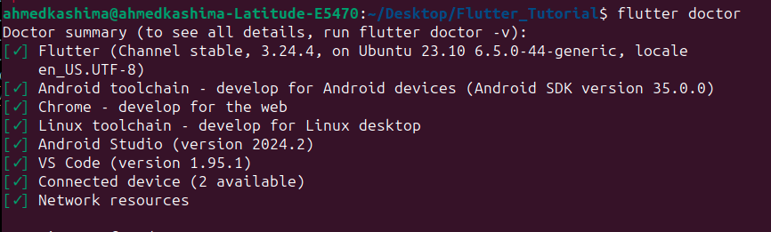
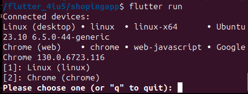
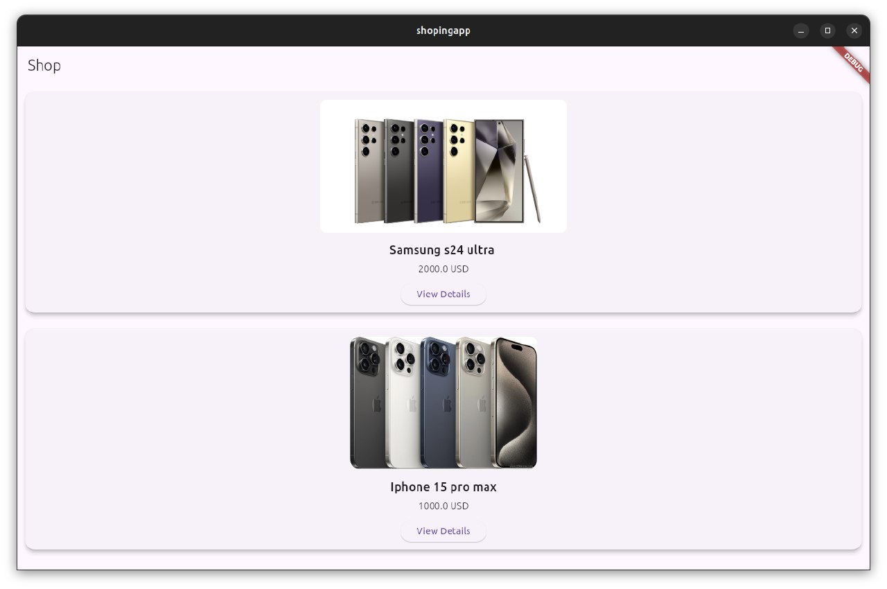

# Методические указания по выполнению задания для платформы React Native

## План

1. [Создание проекта](#создание-проекта)
2. [Структура проекта](#структура-проекта)
3. [Первый запуск](#первый-запуск)
4. [Добавление зависимостей](#добавление-зависимостей)
5. [Создание API](#создание-api)
6. [Создание Views](#создание-views)


## 1. Создание проекта

### Установка окружения
1- Убедитесь, что Node.js установлен на вашем компьютере.
Скачать можно с официального сайта Node.js.
2- Установите Expo CLI глобально:

```bash
npm install -g expo-cli
or 
sudo install -g expo-cli
```
3- Создайте новый проект:

```bash
expo init MyReactNativeApp
```
При создании выберите шаблон (например, blank).





4- Перейдите в папку проекта:
```bash
cd MyReactNativeApp
```


потому что мы использовали expo, поэтому у нас нет файлов для android и ios, поэтому нам нужно npx, чтобы разобраться с ними

```bash
npx expo prebuild
```

                                                                                                         
Дальше установите и настройте эмулятор на android studio

[Android Studio](https://developer.android.com/studio/run/emulator)

## 2. Структура проекта

MyReactNativeApp/
│
├── android/                # Каталог с нативным Android-кодом (сгенерировано prebuild)
├── ios/                    # Каталог с нативным iOS-кодом (сгенерировано prebuild)
├── assets/                 # Папка для статических ресурсов (изображения, шрифты и т.д.)
├── node_modules/           # Зависимости проекта (автоматически устанавливается npm/yarn)
├── App.js                  # Основной компонент приложения
├── app.json                # Конфигурация Expo
├── index.js                # Точка входа приложения
├── package.json            # Метаданные проекта и список зависимостей
├── package-lock.json       # Зафиксированные версии зависимостей


## 3. Первый запуск
- Запустите приложение:

```bash
npm start
```


!дольжен у тебя эмулятор или Установите Expo Go на своем телефоне (доступно в App Store/Google Play).
Отсканируйте QR-код для запуска приложения на устройстве.


## 4. Добавление зависимостей

Основные зависимости:

- Установите навигацию:
```bash
npm install @react-navigation/native react-native-screens react-native-safe-area-context react-native-gesture-handler react-native-reanimated react-native-vector-icons
```



Установите Redux (если нужно управление состоянием):

```bash 
npm install @reduxjs/toolkit react-redux
```


## 5. Создание API
Создание API в React Native подразумевает создание интерфейса для взаимодействия с сервером.
Это обычно включает работу с REST или GraphQL API через такие библиотеки, как fetch или axios.


```bash
npm install axios
```


**Создание клиентского API-модуля**

Создайте файл api.js для управления всеми запросами к серверу.

Файл: src/api/api.js

```bash
import axios from 'axios';

// Создаем экземпляр axios с базовым URL
const apiClient = axios.create({
  baseURL: 'https://example.com/api', // Замените на ваш URL API
  timeout: 10000,
  headers: {
    'Content-Type': 'application/json',
  },
});

// Пример методов API
export const getPhotos = async () => {
  try {
    const response = await apiClient.get('/photos');
    return response.data;
  } catch (error) {
    console.error('Error fetching photos:', error);
    throw error;
  }
};

export const createPhoto = async (photo) => {
  try {
    const response = await apiClient.post('/photos', photo);
    return response.data;
  } catch (error) {
    console.error('Error creating photo:', error);
    throw error;
  }
};
```

**Использование API в компоненте**

Теперь мы можем использовать api.js в компонентах, чтобы загружать данные.

Файл: src/screens/HomeScreen.js

```bash
import React, { useEffect, useState } from 'react';
import { View, Text, FlatList, ActivityIndicator, StyleSheet } from 'react-native';
import { getPhotos } from '../api/api';
import PhotoCard from '../components/PhotoCard';

export default function HomeScreen() {
  const [photos, setPhotos] = useState([]);
  const [loading, setLoading] = useState(true);

  useEffect(() => {
    const fetchPhotos = async () => {
      try {
        const data = await getPhotos();
        setPhotos(data);
      } catch (error) {
        console.error('Error loading photos:', error);
      } finally {
        setLoading(false);
      }
    };

    fetchPhotos();
  }, []);

  if (loading) {
    return <ActivityIndicator size="large" color="#0000ff" />;
  }

  return (
    <View style={styles.container}>
      <FlatList
        data={photos}
        keyExtractor={(item) => item.id.toString()}
        renderItem={({ item }) => <PhotoCard title={item.title} url={item.thumbnailUrl} />}
      />
    </View>
  );
}

const styles = StyleSheet.create({
  container: {
    flex: 1,
    backgroundColor: '#fff',
    padding: 10,
  },
});
```

**Создание сервера**
Установка <code>json-server</code>
```bash
npm install -g json-server
```

Создание файла <code>db.json</code>

```bash
{
  "photos": [
    {
      "id": 1,
      "title": "Sample Photo 1",
      "url": "https://via.placeholder.com/600/92c952",
      "thumbnailUrl": "https://via.placeholder.com/150/92c952"
    },
    {
      "id": 2,
      "title": "Sample Photo 2",
      "url": "https://via.placeholder.com/600/771796",
      "thumbnailUrl": "https://via.placeholder.com/150/771796"
    }
  ]
}
```

***Запуск сервера:***

```bash
json-server --watch db.json --port 3000
```

Итоговая структура проекта
src/
├── api/
│   └── api.js
├── components/
│   └── PhotoCard.js
├── screens/
│   └── HomeScreen.js
├── App.js

Итого
1.Сервер возвращает данные (например, json-server).
2.api.js управляет запросами.
3.Компоненты используют useEffect для вызова API.
4.Данные отображаются в UI через FlatList.


## 6. Views

В React Native View — это контейнер, который поддерживает макет с помощью Flexbox, стиль, обработку сенсорного ввода и элементы управления доступностью.

```bash
// React Native
<FlatList
  data={[ ... ]}
  renderItem={({ item }) => <Text>{item.key}</Text>}
/>
```


# Что такой React Native и Expo и какая Разница между Expo и React Native?

**Expo** и **React Native** позволяют разработчикам создавать кросс-платформенные мобильные приложения с использованием JavaScript. Однако они имеют разные подходы к разработке и отличаются в некоторых аспектах.

## **React Native**:

React Native — это фреймворк для разработки мобильных приложений, который позволяет писать приложения на JavaScript и React, при этом под капотом он использует **родные компоненты** для каждой платформы (iOS и Android). В React Native у вас есть гибкость для написания пользовательского кода для платформ, если это необходимо.

### **Основные особенности React Native**:
- **Гибкость**: React Native дает разработчику больше контроля. Если вам нужно использовать сторонние библиотеки или код, которого нет в Expo, вы можете сделать это напрямую в React Native.
- **Родные модули**: Если вам нужны функции, которые не поддерживаются по умолчанию, вы можете подключить родной код (Java/Kotlin для Android, Swift/Objective-C для iOS).
- **Процесс сборки**: Для React Native требуется настроенная среда разработки на обеих платформах (Android Studio для Android и Xcode для iOS). Сборка приложения производится с использованием инструментов, таких как `react-native-cli`.
- **Настройка**: Вы можете настроить каждый аспект приложения, включая доступ к родным функциям и API платформы.

## **Expo**:

Expo — это набор инструментов и сервисов, построенных вокруг React Native, который упрощает разработку. Expo предоставляет предварительно настроенную среду, с множеством функций и API, которые позволяют разработчикам избегать настройки и быстро начинать работу с React Native.

### **Основные особенности Expo**:
- **Более высокий уровень абстракции**: Expo упрощает разработку, обрабатывая большую часть родного кода за вас. Вам не нужно беспокоиться о сложностях конфигурации iOS или Android.
- **Управляемый рабочий процесс**: Expo предоставляет "управляемый рабочий процесс", где многие сложности работы с родным кодом скрыты. Expo предлагает компоненты и API (например, камеру, геолокацию, уведомления), которые легко интегрируются.
- **Не нужно устанавливать Xcode или Android Studio**: Expo облегчает начинающим разработчикам переход на мобильную разработку, так как не требует установки Android Studio или Xcode. Также вы можете тестировать приложение на устройстве через **Expo Go**.
- **Быстрая настройка**: Настройка с Expo быстрее, чем с React Native, так как требует минимальной конфигурации и автоматически управляет многими зависимостями и родными модулями.
- **Сборка и публикация через серверы Expo**: Expo предоставляет облачные сервисы для сборки и публикации приложения без необходимости настройки локальной среды сборки для iOS и Android.

## **Основные отличия**:

1. **Доступ к родному коду**:
   - **React Native**: Предоставляет полный доступ к родной среде, позволяя писать и настраивать родной код (Objective-C/Swift для iOS, Java/Kotlin для Android).
   - **Expo**: Сосредоточено на управляемой среде с предварительно настроенными решениями. Expo предоставляет большинство необходимых функций без написания родного кода. Однако, если вам нужны кастомные модули, вам нужно будет "выйти" из Expo.

2. **Опыт разработки**:
   - **React Native**: Требует настройки среды для обеих платформ (Xcode для iOS, Android Studio для Android). С этим связано больше настроек, но и больше контроля над приложением.
   - **Expo**: Упрощает разработку с помощью таких инструментов, как Expo CLI и Expo Go для тестирования. Экспонирует сложные платформенные детали, ускоряя процесс разработки для новичков и веб-разработчиков.

3. **Кастомизация и расширяемость**:
   - **React Native**: Вы можете использовать любые сторонние библиотеки, и если библиотека не работает, вы можете изменить или расширить её с помощью родного кода.
   - **Expo**: Expo поставляется с набором предварительно встроенных API, но он ограничен по сравнению с React Native. Если вам нужно больше возможностей, чем те, что предоставляет Expo, вам нужно будет "выйти" из Expo.

4. **Сборка и развертывание**:
   - **React Native**: Сборка и развертывание выполняется на вашем локальном компьютере с использованием Xcode и Android Studio. Это дает больше контроля над процессом сборки.
   - **Expo**: Expo предлагает облачные сервисы для сборки, и вам не нужно настраивать локальную среду. Однако, это может не дать такой гибкости, как работа с локальной средой сборки.

5. **Производительность**:
   - **React Native**: Вы получаете полный контроль над приложением, что позволяет оптимизировать производительность по мере необходимости, включая использование кастомных родных модулей.
   - **Expo**: Может немного снижать производительность из-за абстракции, но для большинства приложений разница в производительности будет незначительной. Однако, если вы выйдете из Expo, то получите полный контроль над оптимизацией производительности.

## **Когда использовать Expo и когда React Native**:

- **Используйте Expo**, если:
  - Вы разрабатываете относительно простое приложение и хотите начать быстро.
  - Вам не нужно много кастомизации родного кода или сложных конфигураций.
  - Вы предпочитаете удобство облачных сборок и упрощенное тестирование.
  - Вы не хотите беспокоиться о специфичных для платформ настройки, таких как Xcode или Android Studio.

- **Используйте React Native**, если:
  - Вам нужен полный контроль над приложением, включая доступ к кастомным родным модулям и библиотекам.
  - Вы хотите использовать более сложные или специфические родные функции.
  - У вас есть опыт разработки родного кода, и вы хотите управлять всеми аспектами приложения.
  - Ваш проект сложный и может требовать расширенных настроек.

## **Eject из Expo**:
Если вы начинаете с Expo и позже понимаете, что вам нужно больше доступа к родному коду или больше кастомизации, вы можете выполнить **eject** из Expo. Это преобразует ваше приложение в стандартный проект React Native, где у вас будет больше контроля над приложением, но вы также потеряете некоторые удобства, предоставляемые Expo.

```bash
expo eject
