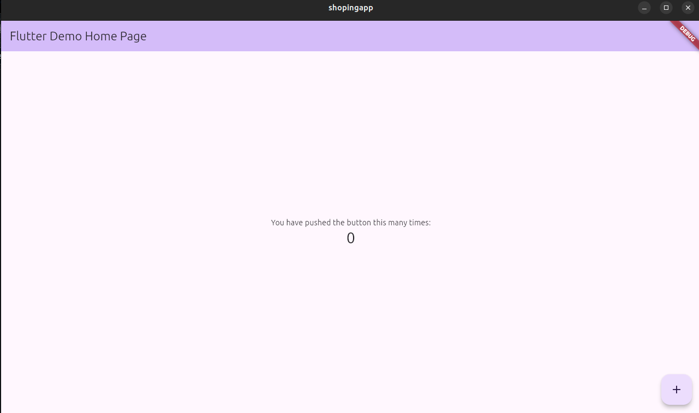
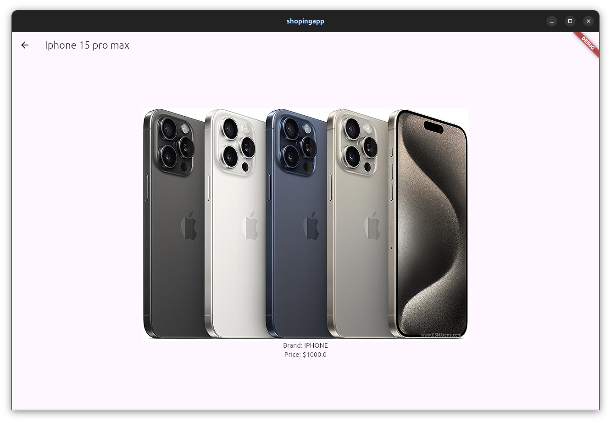
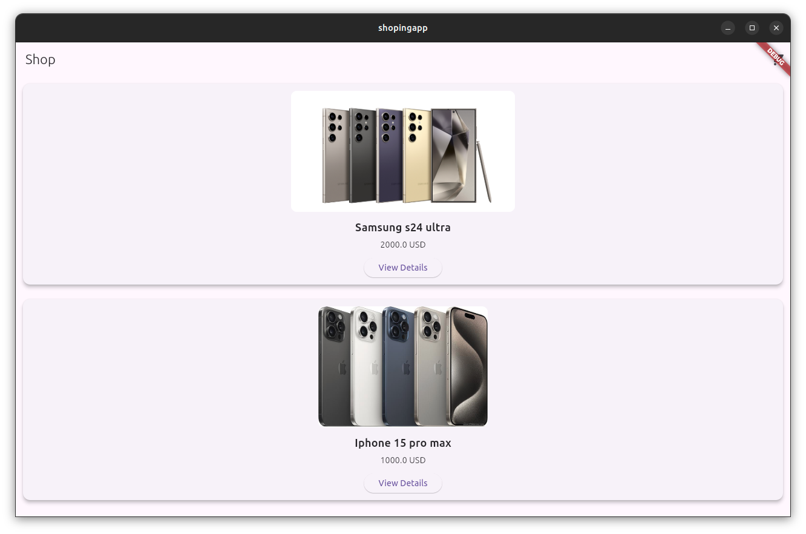
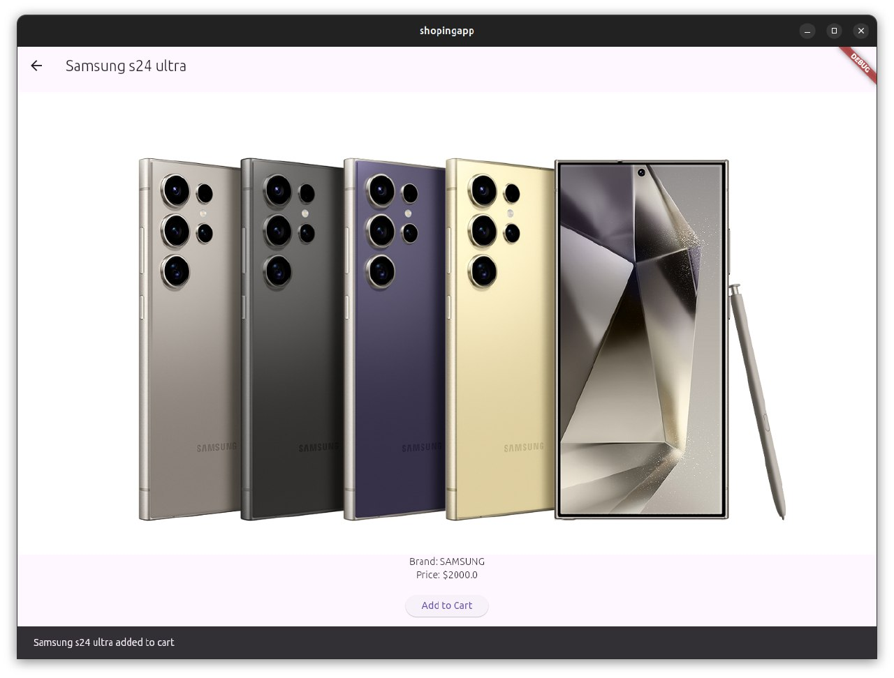
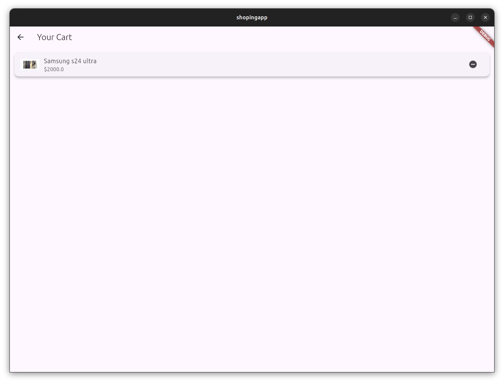

# Методические указания для Flutter


##  Установите редактор кода
- **Рекомендуется**: [Visual Studio Code](https://code.visualstudio.com/) или [Android Studio](https://developer.android.com/studio).
  - Для **VS Code**: Установите расширения **Flutter** и **Dart**.
  - Для **Android Studio**: Установите плагины **Flutter** и **Dart** через раздел **Plugins**.

---


## 4. Проверьте установку Flutter
Запустите команду:
```bash
flutter doctor
```


# 1. Создание проекта

*В командной строке создайте новый проект:*
```bash
flutter create shopingapp
```
*Перейдите в папку проекта:*
```bash
cd shopingapp
```

**Запустите приложение Flutter**

```bash
flutter run
```


У вас будет список доступных устройств, на которых можно запустить приложение Flutter:

    Linux (desktop): Ваше приложение будет запущено как настольное приложение для Linux.
    Chrome (web): Ваше приложение будет запущено как веб-приложение в браузере Google Chrome.

выберите 1




Создаем папку screens, в ней создадим две страницы – главную страницу магазина(shop_screen.dart) и страницу товара(device_screen.dart)

<code>shop_screen.dart</code>

```bash
import 'package:flutter/material.dart';

class ShopScreen extends StatelessWidget {
  @override
  Widget build(BuildContext context) {
    return Scaffold(
      appBar: AppBar(title: Text('Shop')),
      body: Center(
        child: ElevatedButton(
          onPressed: () {
            // Navigate to the DeviceScreen
            Navigator.pushNamed(context, '/device');
          },
          child: Text('Go to device screen'),
        ),
      ),
    );
  }
}
```


Обновите файл main.dart:

```bash
import 'package:flutter/material.dart';
import 'screens/shop_screen.dart';
import 'screens/device_screen.dart';

void main() {
  runApp(MyApp());
}

class MyApp extends StatelessWidget {
  @override
  Widget build(BuildContext context) {
    return MaterialApp(
      title: 'Shopping App',
      initialRoute: '/shop', 
      routes: {
        '/shop': (context) => ShopScreen(),
        '/device': (context) => DeviceScreen(),
      },
    );
  }
}
```


Структура каталога

<pre>
lib/
  screens/
    shop_screen.dart
    device_screen.dart
  main.dart
</pre>

Теперь

создаем <code>store.dart</code>

```bash
class AppState {
  final List<Device> devices;    
  final Device? selectedDevice; 

  AppState({required this.devices, this.selectedDevice});
}
```
AppState описывает структуру состояния приложения:
devices: Список всех доступных устройств.
selectedDevice: Одно устройство, которое выбрано пользователем.


```bash
class SetDevicesAction {
  final List<Device> devices;

  SetDevicesAction(this.devices);
}
```

Экшен — это класс, описывающий действие, которое нужно выполнить с состоянием.
SetDevicesAction:
Содержит список устройств devices, который будет установлен в глобальное состояние.

```bash
AppState appReducer(AppState state, dynamic action) {
  if (action is SetDevicesAction) {
    return AppState(devices: action.devices, selectedDevice: state.selectedDevice);
  }
  return state;
}
```
редюсер — функция, которая принимает текущее состояние (state) и экшен (action), а затем возвращает новое состояние.
В данном случае:

Если получен экшен SetDevicesAction, обновляется список устройств в состоянии.
В противном случае возвращается текущее состояние.


```bash
final store = Store<AppState>(
  appReducer,  // Основной редюсер.
  initialState: AppState(devices: [], selectedDevice: null), // Начальное состояние.
);
```
Хранилище (Store):
Объединяет:
Редюсер (appReducer).
Начальное состояние приложения (initialState).
     initialState:
devices: Пустой список.
        selectedDevice: null.

```bash

import 'package:redux/redux.dart';
import 'package:shopingapp/models/device.dart'; 
class AppState {
  final List<Device> devices;
  final Device? selectedDevice;

  AppState({required this.devices, this.selectedDevice});
}

class SetDevicesAction {
  final List<Device> devices;

  SetDevicesAction(this.devices);
}

AppState appReducer(AppState state, dynamic action) {
  if (action is SetDevicesAction) {
    return AppState(devices: action.devices, selectedDevice: state.selectedDevice);
  }
  return state;
}

final store = Store<AppState>(
  appReducer,
  initialState: AppState(devices: [], selectedDevice: null),
);
```


создаем модель устройства (Device), которая используется для представления данных об устройствах в приложении

```bash

class Device {
  final int id;
  final String title;
  final String brand;
  final double price;
  final String image;

  Device({
    required this.id,
    required this.title,
    required this.brand,
    required this.price,
    required this.image,
  });

  factory Device.fromJson(Map<String, dynamic> json) {
    return Device(
      id: json['id'],
      title: json['title'],
      brand: json['brand'],
      price: json['price'].toDouble(),
      image: json['image'],
    );
  }
}
```


Обновите файл shop_screen.dart:


1. ShopScreen

    Основной виджет (StatelessWidget):
        Это главный экран, где отображается список устройств.
        Используется StoreConnector из пакета flutter_redux, чтобы получить данные из хранилища состояния (AppState).

```bash
StoreConnector<AppState, List<Device>>(
  converter: (store) => store.state.devices,
```
converter: Функция, которая преобразует данные из Redux-хранилища в список устройств devices.

Добавление устройств по умолчанию (если список пуст):
```bash
if (devices.isEmpty) {
  devices = [
    Device(
      id: 1,
      title: 'Samsung s24 ultra',
      price: 2000,
      image: 'assets/images/device1.jpg',
      brand: 'SAMSUNG',
    ),
    ...
  ];
}
```
Отображение списка устройств:
```bash
ListView.builder(
  itemCount: devices.length,
  itemBuilder: (context, index) {
    final device = devices[index];
    ...
```
Переход на экран деталей устройства:
```bash
ElevatedButton(
  onPressed: () {
    Navigator.push(
      context,
      MaterialPageRoute(
        builder: (context) => DeviceDetailScreen(device: device),
      ),
    );
  },
  child: Text('View Details'),
),
```
2. DeviceDetailScreen
    Экран с подробностями устройства:
```bash
class DeviceDetailScreen extends StatelessWidget {
  final Device device;

  DeviceDetailScreen({required this.device});
```

Отображение деталей устройства:
```bash
Center(
  child: Column(
    mainAxisAlignment: MainAxisAlignment.center,
    children: [
      Image.asset(device.image),
      Text('Brand: ${device.brand}'),
      Text('Price: \$${device.price}'),
    ],
  ),
),
```
<code>shop_screen.dart</code>

```bash
import 'package:flutter/material.dart';
import 'package:flutter_redux/flutter_redux.dart';
import 'package:shopingapp/models/device.dart'; 
import 'package:shopingapp/store/store.dart'; 

class ShopScreen extends StatelessWidget {
  @override
  Widget build(BuildContext context) {
    return StoreConnector<AppState, List<Device>>(
      converter: (store) => store.state.devices,  
      builder: (context, devices) {
        if (devices.isEmpty) {
          devices = [
            Device(
              id: 1,
              title: 'Samsung s24 ultra ',
              price: 2000,
              image: 'assets/images/device1.jpg',
              brand: 'SAMSUNG',
            ),
            Device(
              id: 2,
              title: 'Iphone 15 pro max',
              price: 1000,
              image: 'assets/images/device2.jpg',
              brand: 'IPHONE',
            ),
          ];
        }

        return Scaffold(
          appBar: AppBar(title: Text('Shop')),
          body: ListView.builder(
            itemCount: devices.length,
            itemBuilder: (context, index) {
              final device = devices[index];
              return Padding(
                padding: const EdgeInsets.all(8.0),
                child: Card(
                  elevation: 5,
                  shape: RoundedRectangleBorder(
                    borderRadius: BorderRadius.circular(15),
                  ),
                  child: Padding(
                    padding: const EdgeInsets.all(12.0),
                    child: Column(
                      children: [
                        ClipRRect(
                          borderRadius: BorderRadius.circular(10),
                          child: Image.asset(
                            device.image,
                            height: 200, 
                            fit: BoxFit.cover,  //!!! Makes the image fit the size
                          ),
                        ),
                        SizedBox(height: 12),
                        Text(
                          device.title,
                          style: TextStyle(fontSize: 18, fontWeight: FontWeight.bold),
                        ),
                        SizedBox(height: 6),
                        Text('${device.price} USD'),
                        SizedBox(height: 12),
                        ElevatedButton(
                          onPressed: () {
                            Navigator.push(
                              context,
                              MaterialPageRoute(
                                builder: (context) => DeviceDetailScreen(device: device),
                              ),
                            );
                          },
                          child: Text('View Details'),
                        ),
                      ],
                    ),
                  ),
                ),
              );
            },
          ),
        );
      },
    );
  }
}

class DeviceDetailScreen extends StatelessWidget {
  final Device device;

  DeviceDetailScreen({required this.device});

  @override
  Widget build(BuildContext context) {
    return Scaffold(
      appBar: AppBar(title: Text(device.title)),
      body: Center(
        child: Column(
          mainAxisAlignment: MainAxisAlignment.center,
          children: [
            Image.asset(device.image),  
            Text('Brand: ${device.brand}'),
            Text('Price: \$${device.price}'),
          ],
        ),
      ),
    );
  }
}
```
Добавление зависимостей

Откройте файл pubspec.yaml и добавьте необходимые пакеты для работы приложения.

```bash
dependencies:
  flutter:
    sdk: flutter
  flutter_redux: ^0.8.0
  redux: ^4.0.0
  provider: ^6.0.0
```
for pics
```bash
flutter:
  assets:
    - assets/images/
```


И конечно Обновите файл <code>main.dart</code>:

```bash
import 'package:flutter/material.dart';
import 'package:flutter_redux/flutter_redux.dart';
import 'package:shopingapp/store/store.dart'; 
import 'package:shopingapp/screens/shop_screen.dart';
import 'package:shopingapp/store/sotre.dart'; 

void main() {
  runApp(MyApp());
}

class MyApp extends StatelessWidget {
  @override
  Widget build(BuildContext context) {
    return StoreProvider(
      store: store,  
      child: MaterialApp(
        home: ShopScreen(), 
      ),
    );
  }
}
```


Структура каталога lib

<pre>
── lib
│   ├── main.dart
│   ├── models
│   │   └── device.dart
│   ├── screens
│   │   └── shop_screen.dart
│   └── store
│       └── store.dart
</pre>

**assets**

<pre>
├── assets
│   └── images
│       ├── device1.jpg
│       └── device2.jpg
</pre>





# создать корзина

создаем cart_screen.dart

```bash
import 'package:flutter/material.dart';
import 'package:flutter_redux/flutter_redux.dart';
import 'package:shopingapp/models/device.dart'; 
import 'package:shopingapp/store/store.dart'; 

class CartScreen extends StatelessWidget {
  @override
  Widget build(BuildContext context) {
    return StoreConnector<AppState, List<Device>>(
      converter: (store) => store.state.cart,  
      builder: (context, cart) {
        return Scaffold(
          appBar: AppBar(title: Text('Your Cart')),
          body: cart.isEmpty
              ? Center(child: Text('Your cart is empty!'))
              : ListView.builder(
                  itemCount: cart.length,
                  itemBuilder: (context, index) {
                    final device = cart[index];
                    return Padding(
                      padding: const EdgeInsets.all(8.0),
                      child: Card(
                        elevation: 5,
                        child: ListTile(
                          leading: Image.asset(device.image, width: 50),
                          title: Text(device.title),
                          subtitle: Text('\$${device.price}'),
                          trailing: IconButton(
                            icon: Icon(Icons.remove_circle),
                            onPressed: () {
                              // Remove the device from the cart
                              StoreProvider.of<AppState>(context).dispatch(RemoveFromCartAction(device));
                            },
                          ),
                        ),
                      ),
                    );
                  },
                ),
        );
      },
    );
  }
}
```

создаем <code>device_detail_screen.dart</dart>


```bash
return Scaffold(
  appBar: AppBar(title: Text(device.title)), // Заголовок с названием устройства.
  body: Center(
    child: Column(
      mainAxisAlignment: MainAxisAlignment.center,
      children: [
        Image.asset(device.image),            // Картинка устройства.
        Text('Brand: ${device.brand}'),       // Бренд устройства.
        Text('Price: \$${device.price}'),     // Цена устройства.

```
AppBar: Отображает название устройства.
Image.asset: Показывает картинку устройства из локального хранилища (assets).
Text: Отображает бренд и цену устройства.

Добавление устройства в корзину
```bash
ElevatedButton(
  onPressed: () {
    StoreProvider.of<AppState>(context).dispatch(AddToCartAction(device));
    ScaffoldMessenger.of(context).showSnackBar(
      SnackBar(content: Text('${device.title} added to cart')),
    );
  },
  child: Text('Add to Cart'),
),
```

Кнопка "Add to Cart":
При нажатии выполняет следующие действия:
Получает доступ к глобальному хранилищу Redux через StoreProvider.of<AppState>(context).
Отправляет (dispatch) действие AddToCartAction(device), чтобы добавить устройство в корзину.
Показывает уведомление (SnackBar) с подтверждением.
Важно:
Для работы этой кнопки необходим экшен AddToCartAction и соответствующий редюсер, который добавляет устройство в корзину (их нужно реализовать в Redux-хранилище).

 Кнопка "Back to Shop"
```bash
ElevatedButton(
  onPressed: () {
    Navigator.pop(context);
  },
  child: Text('Back to Shop'),
),
```
Возвращает пользователя на предыдущий экран (в данном случае, на экран магазина).

Redux: Добавление устройства в корзину

Чтобы функциональность "добавления в корзину" работала, необходимо:

Создать экшен AddToCartAction:
```bash
class AddToCartAction {
  final Device device;

  AddToCartAction(this.device);
}

    Добавить корзину (cart) в состояние AppState:

class AppState {
  final List<Device> devices;
  final List<Device> cart;        // Корзина
  final Device? selectedDevice;

  AppState({
    required this.devices,
    required this.cart,           // Инициализация корзины
    this.selectedDevice,
  });
}
```

Обновить редюсер (appReducer):

```bash
AppState appReducer(AppState state, dynamic action) {
  if (action is AddToCartAction) {
    return AppState(
      devices: state.devices,
      cart: List.from(state.cart)..add(action.device), // Добавляем устройство в корзину.
      selectedDevice: state.selectedDevice,
    );
  }
  return state;
}
```


```bash
import 'package:flutter/material.dart';
import 'package:shopingapp/models/device.dart';
import 'package:shopingapp/store/store.dart'; 
import 'package:flutter_redux/flutter_redux.dart';

class DeviceDetailScreen extends StatelessWidget {
  final Device device;

  DeviceDetailScreen({required this.device});

  @override
  Widget build(BuildContext context) {
    return Scaffold(
      appBar: AppBar(title: Text(device.title)),
      body: Center(
        child: Column(
          mainAxisAlignment: MainAxisAlignment.center,
          children: [
            Image.asset(device.image),  
            Text('Brand: ${device.brand}'),
            Text('Price: \$${device.price}'),
            SizedBox(height: 20),
            ElevatedButton(
              onPressed: () {
                StoreProvider.of<AppState>(context).dispatch(AddToCartAction(device));
                ScaffoldMessenger.of(context).showSnackBar(SnackBar(content: Text('${device.title} added to cart')));
              },
              child: Text('Add to Cart'),
            ),
            SizedBox(height: 20),
            ElevatedButton(
              onPressed: () {
                Navigator.pop(context);
              },
              child: Text('Back to Shop'),
            ),
          ],
        ),
      ),
    );
  }
}
```





